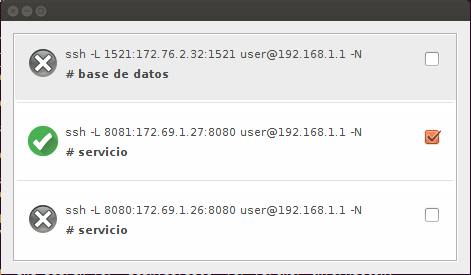

# tun
Manager de tuneles ssh

##Requsitos

	Jdk 1.6 >
	Sistema Operativo: Solo funciona con Linux (por ahora)

##Compilar

	mvn package

##Ejecución

	java -jar tun.jar <archivo1> <archivo2> <archivoN>

##Formato de archivo

El archivo puede tener cualquier extensión. Lo importante es el contenido, debe seguir esta estructura ->

	# tag
	ssh <parametros>

Ejemplo

	# servicio
	ssh -L 8080:172.69.1.26:8080 user@192.168.1.1 -N
	ssh -L 8081:172.69.1.27:8080 user@192.168.1.1 -N

	# base de datos
	ssh -L 1521:172.76.2.32:1521 user@192.168.1.1 -N 
